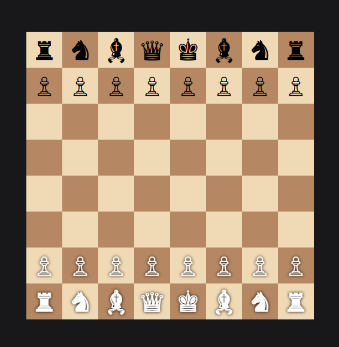

# Chess Game Web Application

A web-based chess game built using **Node.js**, **Express.js**, and **EJS**. It features a responsive design with styles managed using **Tailwind CSS**, and game logic implemented in **JavaScript**.

## Project Structure

```
.
├── node_modules/          # Dependencies
├── public/                # Static files
│   ├── css/               # Stylesheets
│   │   └── style.css
│   └── js/                # JavaScript files
│       └── chessgame.js
├── src/                   # Additional CSS styles
│   └── styles.css
├── views/                 # EJS templates
│   └── index.ejs
├── .env                   # Environment variables
├── app.js                 # Main application file
├── package.json           # Project dependencies and scripts
├── tailwind.config.js     # Tailwind CSS configuration
```

## Features

- Interactive chess game implementation.
- Responsive user interface with **Tailwind CSS**.
- Server-side rendering using **EJS** templates.
- Modular and configurable port via `.env`.

## Prerequisites

Ensure you have the following installed:

- [Node.js](https://nodejs.org) (version 14+ recommended)
- [npm](https://www.npmjs.com/) or [yarn](https://yarnpkg.com/)

## Installation

1. Clone the repository:

   ```bash
   git clone https://github.com/priyanshuk6395/chess-game.git
   cd chess-game
   ```

2. Install dependencies:

   ```bash
   npm install
   ```

3. Start the development server:

   ```bash
   npm start
   ```

5. Open the application in your browser at [http://localhost:3000](http://localhost:3000).

## Scripts

- **Start Server**: `npm start`
- **Development Mode**: `npm run dev` (requires `nodemon`)

## Contributing

Contributions are welcome! To contribute:

1. Fork the repository.
2. Create a new branch (`git checkout -b feature-branch`).
3. Make your changes.
4. Submit a pull request.

## License

This project is licensed under the [MIT License](LICENSE).

---

### Screenshot



---
